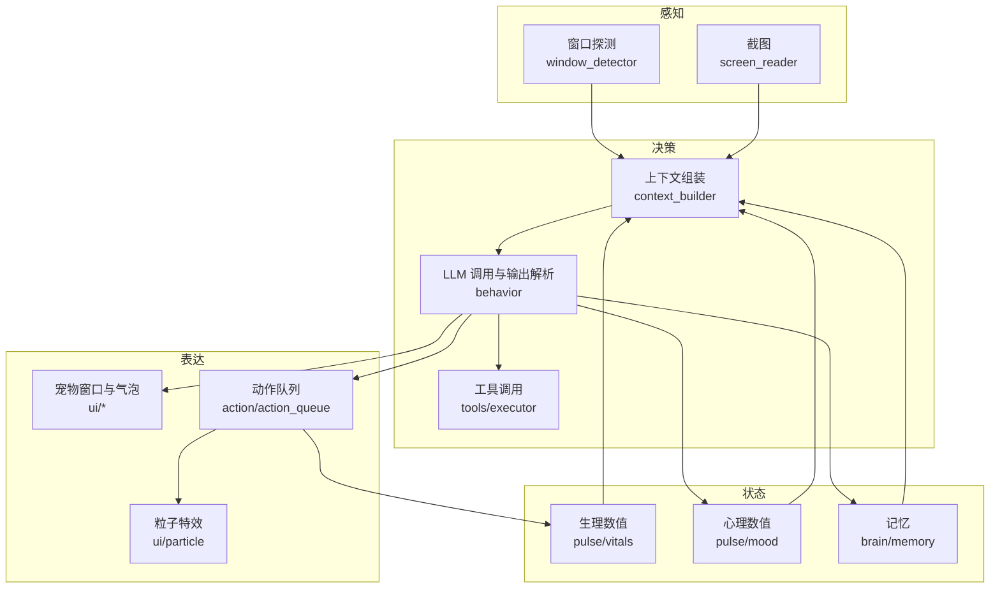

# 架构总览

本文是理解这个项目的入口：进程与线程怎么组织、一次决策从头到尾经过哪些环节、哪些文件负责什么。

- 本文**手写**，事实以代码为准；函数名与结构变化时请一并更新这里。
- 机械展开的参考表由脚本生成，见 [reference/](reference/)（配置项 / 动作 / 工具 / 粒子特效 / 提示词块 / 模块清单）。
- 术语（vitals、mood、needs、outcome、aside…）见 [glossary.md](glossary.md)。
- 子系统深入见 [subsystems/](subsystems/)：记忆、数值、动作动画、提示词、素材规格。
- 发布流程见 [operations/release.md](operations/release.md)，排障见 [operations/troubleshooting.md](operations/troubleshooting.md)。
- 某个设计「为什么这么做」见 [decisions/](decisions/README.md)。
- 参与开发看 [../CONTRIBUTING.md](../CONTRIBUTING.md)。

## 1. 一分钟速览

桌宠是单进程 GUI 程序：一个 Qt 主线程负责界面，一条「脑线程」按需发起 LLM 请求，
三档定时器驱动生理/心理数值、自主决策与后台维护。

分层的边界是：`ui` 只管画与点，`agent` 管编排，`brain` 管与模型交互与记忆，`action` 管动作执行，
`pulse` 管数值，`tools` 是被 LLM 调用的外部能力。

贯穿全项目的几条取向，改动时可以拿它们当尺子：

- **简单优先**：单进程、无 asyncio、无线程池；能用一个定时器解决的不要引入调度框架。
- **真源优先**：每类事实只写一处（配置 `_KEY_META`、动作 `REGISTRY`、特效 `_SPAWNERS`、工具注册表），
  其余由 `scripts/gen_docs.py` 生成，靠 CI 防漂移。
- **隔离优先**：测试与文档脚本必须能在不碰用户配置、不装 Qt、不联网的前提下跑起来
  （临时目录 + offscreen + 空模块顶替）。
- **缓存优先**：提示词里会变的东西一律放 user 段，保住 system 前缀命中服务端缓存。
- **装配集中**：跨层协作靠模块级单例（`config` / `TOOL_REGISTRY` / `TOOL_CTX` / `GAME`）在 `main()`
  里接线，下层不反向 import 上层，详见
  [0009](decisions/0009-layering-by-singletons-and-deferred-imports.md)。

## 2. 进程与线程模型

单进程、无 `asyncio`、无线程池、无 multiprocessing。跨线程协作靠 Qt 信号；需要长耗时又不想占线程的
操作（记忆落库、摘要、单个工具）另起 daemon 线程。

| 执行体 | 职责 | 关键文件 |
|---|---|---|
| GUI 主线程 | 所有 QWidget/QObject；定时器回调；动作队列推进；状态迁移；LLM 结果落 UI | `pet/app.py`、`pet/ui/` |
| 脑线程（同一时刻最多一条） | 一次决策全流程：组装上下文 → 调 LLM → 解析输出 → 执行工具轮次 | `pet/agent/pet_agent.py`、`pet/brain/behavior.py` |
| 调度器 fast（默认 1s） | 看门狗、生理 tick、待机动画、粒子 | `pet/agent/scheduler.py`、`pet/agent/scheduled_tasks.py` |
| 调度器 mid（默认 300s） | 自主决策触发 | 同上 |
| 调度器 slow（默认 300s） | 数值落库、数值衰减、记忆维护、对话清理 | 同上 |
| daemon 线程 | 记忆写入、摘要生成、单个工具执行、语音识别 | `pet/brain/memory*.py`、`pet/tools/executor.py`、`pet/voice/` |

要点：

- **脑线程单例**：`PetAgent._async_brain()` 在启动新线程前会取消并「退休」旧线程；`_retire()`
  绝不析构仍在运行的 QThread，只是持引用等它自己结束，避免 Qt 崩溃。
- **抢不到就让路**：流式决策要抢 `Behavior` 内部的一把 `RLock`，同一时刻只允许一条管线真正
  跑 LLM。autonomous / interact 抢不到锁就降级本地兜底（`_decide_local`），chat 抢不到直接
  回一句固定台词加 `look_around`，都不排队；非流式路径不抢锁。
- **数值只在主线程改**：`vitals`/`mood` 的修改与落库都发生在主线程（定时器回调或 `_on_brain_result`），
  脑线程只回传 delta。
- **取消靠协作**：脑线程不会被杀掉，靠 `_cancel_flag` 与世代号 `_active_stream_id` 让旧管线在下一个轮询点自行退出。

## 3. 启动与退出

启动（`pet/app.py` 的 `main()`）：

1. 配置加载与控制台日志。
2. 单实例锁：`QLockFile`（与 `settings.json` 同目录）；已被占用则弹提示并退出，锁不可用则放行并告警。
3. 应用上一次更新遗留的 `update.*.new` 脚本（`pet/self_update.py`）。
4. 挂上文件日志 `logs/koishiai.log`（按天轮转，保留 3 份）；崩溃钩子在 `pet/__init__.py`
   导入期就装好了，`main()` 里只按配置开关。
5. 加载工具插件：`load_tools(config.TOOLS_ENABLED)`（缺依赖的工具首次会 pip 安装）。
6. 创建 `QApplication` → `PetAgent` → `PetWindow` → 气泡/托盘 → 信号互联。
7. `window.show()` → `agent.start()`（启动 5 秒后触发第一轮自主决策）→ 托盘 → 延迟 5 秒做版本检查 → `app.exec()`。

退出：`aboutToQuit` 清日志 handler 与启动标记、释放单实例锁；`_do_quit()` 保存上下文与统计、`agent.stop()`；
若仍有脑线程在跑，用 `os._exit()` 跳过解释器清理，避免退出期崩溃。

## 4. 数据流：一次决策的全过程

以自主决策为例，环节与归属：

1. **感知**：窗口探测 `context_builder.build_window_context()`（分平台后端在 `pet/brain/*_detector.py`，
   过滤遮挡后取前若干个窗口，输出中文文本）；截图 `pet/agent/screen_reader.py`（受 `VISION_ENABLED` 控制）。
2. **上下文组装**：`pet/brain/context_builder.py`。三个入口 `build_autonomous_decide` / `build_chat_decide` /
   `build_interact`，内部按「静态块 + 运行时块 + 记忆」拼装，详见第 5 节。
3. **LLM 调用**：`pet/brain/behavior.py` 的流式路径 `*_decide_stream`（首选）与非流式 `*_decide`（回退）。
   客户端 `pet/brain/llm_client.py` 维护首选/备选两套方案，重试与降级策略在 `pet/brain/llm_retry.py`。
4. **输出解析**：按行前缀分派 —— `Summary` / `Speech` / `Action` / `Memory` / `Emotion` / `Mood` / `Vitals`
   （流式与非流式两套解析器，聚合为 `BehaviorOutput`）。非流式解析器在没有 Action 时兜底
   `sit 5s`，流式路径没有这个兜底。
5. **工具轮次**：`_handle_tool_calls()` 循环执行 LLM 请求的工具，最多 `LLM_TOOL_MAX_ROUNDS` 轮；
   元工具（`tool_search`、`recall` 等）不占配额。单个工具在 `pet/tools/executor.py` 里带超时执行。
6. **动作执行**：`BehaviorOutput` 里的动作交给 `ActionQueue`（`pet/action/action_queue.py`）串行播放，
   实际动作方法在 `pet/action/action.py`；重力与「站在窗口上」由 `pet/action/gravity.py` 负责。
   动作正常结束后结算产出（`pet/action/outcome.py`），钓鱼等玩法由此接入。
7. **数值更新**：LLM 给出的 `Mood`/`Vitals` 增量落到 `pet/pulse/mood.py`、`pet/pulse/vitals.py`；
   动作本身也消耗精力（`Vitals.apply_action_delta`，fast tick）；自然衰减在 slow tick。
8. **持久化**：数值与上下文、记忆、对话历史写 SQLite（`pet/db.py` 统一连接），见第 10 节。

## 5. 上下文与提示词组装

system prompt 由三段拼起来：

1. **静态块**：`pet/brain/prompts.py` 的 `build_system_prompt(mode, task)`
   —— 身份、独立生活设定、输入可信度、人格、称呼、表达底线、记忆格式、感知段（含动作表）、任务段。
2. **运行时块**：`context_builder._build_system()` 生成后替换 `<<FEELING>>` 锚点
   —— `[你现在的状态]`（数值翻译成感受 + 求关注提示）、`[你惦记着的事]`（未满足需求 + 忽然想起来的旧事）、
   `[最近发生了什么]`（近期事件）。
3. **记忆检索**：`[你对用户的记忆]`，由 `pet/brain/memory.py` 的召回策略给出。

`mode`（`autonomous_vision` / `autonomous_non_vision` / `chat_vision` / `chat_non_vision` / `interact`）决定感知段，
`task`（`autonomous` / `chat` / `interact`）决定任务段；合法组合是白名单，写错直接抛 `ValueError`
（见 [reference/prompt-blocks.md](reference/prompt-blocks.md)）。

几个有意的取舍（改提示词前先看一眼）：

- **system 段尽量稳定，变动的东西放 user 段**：当前时间、窗口内容、用户消息都进 user prompt，
  这样 system 前缀可以命中 prompt 缓存（`LLM_CACHE_PROMPT`）。
- **数值不直接进提示词**：数值先被翻译成自然语言感受（`_build_feeling`），档位与阈值在代码里有明确对应关系。
- **「该怎么做」集中在一处**：需求对应的做法只写在「你惦记着的事」章节（`_NEED_HINTS`），
  感受描述里不再重复祈使句，避免两处引导互相打架。
- **即时交互不注入需求**：`interact` 是对单一事件的反射，注入长上下文只会让台词跑偏。

## 6. 三条任务路径

| | autonomous | chat | interact |
|---|---|---|---|
| 触发 | mid tick；启动 5 秒后 | 用户发送消息 | 抓起/放下/站立窗口消失/投喂/工具请求 |
| 入口 | `PetAgent._autonomous_pipeline` | `_trigger_chat` → `_chat_pipeline` | `_trigger_interact` → `_interact_pipeline` |
| 提示词 | `autonomous_vision` / `autonomous_non_vision` | `chat_vision` / `chat_non_vision` | `interact` |
| 状态 | 需 IDLE 才能进入 AUTONOMOUS | 进入 INTERACTING，交互中被忽略 | 进入 INTERACTING，有节流与冷却 |
| 产出 | 气泡、动作、数值变化、记忆 | 同上 + 对话历史 | 通常只有一句话 |

补充：**鼠标悬停不发 LLM 请求**，只显示聊天气泡、喂食与音乐按钮；真正触发决策的是拖拽、放置、
窗口消失、投喂等事件。三条路径共享同一个工具轮次预算与看门狗。

## 7. 状态机与看门狗

状态只有三个：`IDLE`、`AUTONOMOUS`、`INTERACTING`（`pet/agent/state.py`）。
合法迁移是三者之间相互转换，`can_decide`（空闲）才允许发起自主决策；`chat` 与 `interact` 共用
`INTERACTING`，因此二者互斥。`force()` 绕过校验，只给看门狗恢复用。

看门狗（fast tick `_brain_watchdog`）：

- 只在 `AUTONOMOUS`/`INTERACTING` 下检查，阈值 `BRAIN_STUCK_TIMEOUT`（默认 300 秒无进展）；
- 有进行中的游戏对局时视为有进展，避免等玩家落子的正常等待被误判；
- 「进展」由 `Behavior` 在收到 chunk、执行工具轮次等时机上报（`_note_progress`）；
- 判定挂死后：取消脑线程（退休延迟到下一次 `_async_brain` 或 `stop()` 再做）→ 强制回 `IDLE`
  → 关闭加载态 → 托盘提示。

崩溃与异常：`pet/crash_reporter.py` 写 `logs/startup.state` 标记运行状态，异常时落
`logs/crash/crash_*.json|.txt`（保留最近 10 份），下次启动若发现上次异常退出会补写报告。

## 8. 定时任务

| 档位 | 任务 | 作用 |
|---|---|---|
| fast | `_brain_watchdog` | 脑线程看门狗 |
| fast | `_vitals_tick` | 动作驱动的精力/饱食消耗；理智低时的表情与粒子 |
| fast | `_update_idle_anim`、`_spawn_particles` | 待机动画与粒子刷新 |
| mid | `_autonomous` | 自主决策触发 |
| slow | `_vitals_save`、`_mood_save` | 数值落库 |
| slow | `_vitals_check`、`_mood_check` | 阈值检查与自然衰减 |
| slow | `_memory_maintenance` | 记忆维护（过期、压缩） |
| slow | `_conversation_cleanup` | 对话历史清理 |

调度器会在系统空闲超过 `SCHEDULER_IDLE_TIMEOUT_MS` 时暂停全部定时器，用户回来再恢复；
`schedule_at()` 提供一次性闹钟（工具侧通过 `TOOL_CTX.register_alarm` 使用）。

## 9. 模块职责

| 包 | 职责 | 主要文件 |
|---|---|---|
| `pet/agent/` | 编排层：`PetAgent` 管线、三速调度、状态机、截图 | `pet_agent.py`、`scheduler.py`、`scheduled_tasks.py`、`state.py` |
| `pet/brain/` | 决策与记忆：上下文组装、LLM 客户端与重试、输出解析、记忆库、窗口探测、对话历史 | `behavior.py`、`context_builder.py`、`prompts.py`、`memory.py` |
| `pet/action/` | 动作系统：动作定义与注册、帧动画播放队列、重力与站立、动作产出 | `registry.py`、`action.py`、`action_queue.py`、`gravity.py` |
| `pet/pulse/` | 数值引擎：生理（饱食/精力）与心理（好感/愉悦/理智），含衰减、阈值与落库 | `vitals.py`、`mood.py` |
| `pet/tools/` | 工具层：注册表、执行器、上下文、加载器，以及各工具子包 | `registry.py`、`executor.py`、`context.py` |
| `pet/ui/` | 界面层：宠物窗口、各类气泡、表情、粒子、设置/调试/记忆面板、托盘 | `pet_window.py`、`particle.py`、`settings_window.py` |
| `pet/food/` | 觅食：需求驱动的地面食物生成与食用 | `food.py` |
| `pet/game/` | 小游戏：猜数字、猜拳、井字棋、二十问 | `gamebase.py` 与各游戏 |
| `pet/voice/` | 语音输入：热键、麦克风采集、讯飞听写 | `voice_session.py` |
| `assets/` | 素材：每个动作一个目录（`<name>.json` + 帧 webp） | `assets/actions/` |
| `tests/` | pytest 用例（CI 在 ubuntu + windows 上跑） | 见 `CONTRIBUTING.md` |

顶层模块（`pet/*.py`）：

| 模块 | 职责 |
|---|---|
| `pet/__init__.py` | 包简介；**导入期安装崩溃收集钩子**（测试与文档脚本都用空模块顶替它） |
| `pet/__main__.py` | `python -m pet` 入口 |
| `pet/app.py` | 主入口：启动装配、Qt 对象创建、信号互联、退出流程 |
| `pet/auto_start.py` | 开机自启（Windows / macOS / Linux） |
| `pet/config.py` | 配置项真源 `_KEY_META` 与 `Config` 单例，负责合并 `settings.json` 与生成 schema |
| `pet/crash_reporter.py` | 崩溃报告、启动标记、原生崩溃（faulthandler）捕获 |
| `pet/db.py` | 数据库路径与统一 SQLite 连接配置（WAL、busy_timeout） |
| `pet/self_update.py` | 启动时应用上一次更新遗留的 `update.*.new` 脚本 |
| `pet/settings.py` | `settings.json` 的读写与跨平台路径、原子写入 |
| `pet/single_instance.py` | 单实例锁（`QLockFile`） |
| `pet/version_check.py` | 启动后检查 GitHub Release 版本（在后台 QThread 里跑） |
| `pet/version_utils.py` | 版本号解析与比较（纯逻辑，方便测试） |

每个 `.py` 的一句话职责见 [reference/modules.md](reference/modules.md)（生成物，随代码更新）。

## 10. 持久化与运行期文件

| 位置 | 内容 | 说明 |
|---|---|---|
| `%APPDATA%/KoishiAI/settings.json` | 用户配置（macOS/Linux 见 `pet/settings.py`） | 与默认值合并；`settings-schema.json` 是给外部编辑器的 schema |
| `<项目根>/pet.db` | SQLite：`vitals`、`mood`、`context_entries`、`context_meta`、`chat_history`、记忆相关表 | 连接参数统一在 `pet/db.py`（WAL、busy_timeout） |
| `pet/tools/<tool>/config.json` | 工具私有配置 | 首次运行时由 `config.example.json` 复制生成 |
| `logs/` | `koishiai.log`（按天轮转 3 份）、`crash/`（崩溃报告）、`startup.state` | 排查问题先看这里 |
| `KoishiAI.lock` | 单实例锁（与 settings.json 同目录） | 异常残留时可手删 |

更新流程（`update.sh` / `update.bat`）从 GitHub Release 下载源码包同步覆盖，
**保留** `venv/`、`logs/`、`*.db`、`config.json` 与更新脚本自身；用户配置在 `%APPDATA%`，不受影响。

## 11. 关键约定与不变量

改动前值得先确认的几条「红线」，它们大多没有被类型系统保护，只能靠人守：

1. **提示词块三处同步**：新增 `mode`/`task` 必须同时改 `_PERCEPTION_SECTIONS`、`_TASK_SECTIONS`
   与 `build_system_prompt` 里的组合白名单。
2. **阈值与文案档位同步**：需求判定阈值（`context_builder._NEED_THRESHOLD`）与感受描述的档位必须对齐；
   理智用 `SANITY_CRITICAL_THRESHOLD` 而非通用阈值（理智不参与自然衰减）。
3. **system 里不写会频繁变化的内容**（时间、窗口、消息），否则 prompt 缓存失效。
4. **被动注入的记忆不更新访问统计**：`MemoryStore.random_events()` 刻意不 `touch`，
   否则「被抽到」会提高权重，形成自我强化。
5. **动作名的唯一真源是 `ACTION_NAMES`**：LLM 输出会用它校验，未知动作被丢弃并兜底。
6. **粒子特效名唯一真源是 `_SPAWNERS`**：调试面板、动作映射都按这里的名字取。
7. **配置项唯一真源是 `_KEY_META`**：新增项要重新生成参考文档；要在设置界面显示还得在对应页签加控件
   （页签归属是界面代码手写的，和 `category` 不是一回事）。
8. **工具目录约定**：`pet/tools/<name>/__init__.py` 必须定义 `TOOL_NAME`、`TOOL_DESCRIPTION`、`register()`；
   `TOOL_GROUP`、`requirements.txt`、`config.example.json` 可选。
9. **素材成对**：`assets/actions/<name>/` 里的帧文件排序即播放顺序，`<name>.json` 缺失则该动作不加载。
10. **数值只在主线程改**：脑线程只回传 delta，落库在定时器里做。
11. **文档与代码同步**：改动配置/动作/工具/特效/提示词块后运行 `python scripts/gen_docs.py`，
    CI 会用 `--check` 拦截漂移。
12. **新增 `.py` 不要引入导入期副作用**：包导入期会安装崩溃钩子，测试与文档脚本都靠顶替模块来隔离。
13. **依赖方向只能自上而下**：`ui` / `agent` 可以用 `brain` / `action` / `pulse` / `tools`，反向不行。
    下层要驱动上层（让桌宠说话、记一笔）用 `TOOL_CTX`，不要 import 上层模块。
14. **不要跨对象访问私有成员**：需要别的类的能力就给它一个公开方法，或者把协作提到调用方。
    现存的例外列在 §14，新代码不要再加。
15. **函数内延迟 import 只在两种情况下写**：打断循环依赖、推迟重依赖（Qt / 平台后端 / playwright）。
    没有理由就不要延迟，写了就在旁边注明原因。

## 12. 常见改动入口

| 想做什么 | 改哪里 | 别忘了 |
|---|---|---|
| 加一个动作 | 放素材 `assets/actions/<name>/`，在 `pet/action/registry.py` 注册 | 带时长的动作要进 `_DURATION_ACTION_DEFS`；重生成 [reference/actions.md](reference/actions.md) |
| 加一个粒子特效 | `pet/ui/particle.py` 的 `_SPAWNERS` 与 `_DEFAULT_Y` | 调试面板自动列出；重生成 [reference/effects.md](reference/effects.md) |
| 加一个配置项 | `pet/config.py` 的 `_KEY_META` | 要在界面可见则同时改 `pet/ui/settings_window.py`；重生成 [reference/config.md](reference/config.md) |
| 改提示词 | `pet/brain/prompts.py`；运行时段落改 `pet/brain/context_builder.py` | 组合白名单；重生成 [reference/prompt-blocks.md](reference/prompt-blocks.md) |
| 加一个工具 | `pet/tools/<name>/__init__.py` | 声明 `TOOL_NAME`/`TOOL_DESCRIPTION`/`register()`，可加 `TOOL_GROUP`；重生成 [reference/tools.md](reference/tools.md) |
| 调数值手感 | `pet/pulse/vitals.py`、`pet/pulse/mood.py` + `_KEY_META` 的阈值项 | 文案档位同步（第 11 节第 2 条） |
| 改记忆策略 | `pet/brain/memory.py` | 被动注入不要动访问统计 |
| 加/改窗口探测 | `pet/brain/window_detector.py` 与各平台后端 | 三个平台保持同一接口 |
| 改更新流程 | `update.sh` / `update.bat` | 保留用户数据清单见第 10 节 |

## 13. 已知遗留与陷阱

下面几处看起来像 bug，其实是历史包袱，改之前先确认：

- `update.sh` / `update.bat` 的排除清单里有 `config.json`，但运行时代码不读项目根目录的 `config.json`
  ——用户配置在 `%APPDATA%/KoishiAI/settings.json`，这一条是历史遗留。
- `_KEY_META` 的 `placeholder` 字段没有任何读取点，设置界面的占位符是界面里硬编码的。
- `QThreadPool` 在 `pet/agent/pet_agent.py` 被 import 但未使用；并发用的是单条 QThread + 少量 daemon 线程。
- 数值阈值信号（饿、累、理智低等）大多没有消费者，它们对模型的影响全靠「感受 → 提示词」这条路；
  唯一被消费的是好感提升时的爱心粒子。

## 14. 已知设计债

### 依赖环

| 环 | 性质 | 现状与出路 |
|---|---|---|
| `pet.brain` → `behavior` → `context_builder` → `pet.brain` | 唯一的**真实顶层环** | `context_builder.py` 写的是 `from pet.brain import prompts`，绕回包 `__init__`；靠 Python「from 包 import 子模块」的兜底才没炸。改成 `from pet.brain.prompts import ...` 就能断开 |
| `pet.tools.todo` ↔ `pet.tools.todo.panel` | 设计层面，靠函数内延迟 import 规避 | 面板与工具主体互相引用，出路是把共享状态抽到第三个模块 |

其余函数内 import 大多正当（见 §11 第 15 条）；也有随手写的，比如
`pet_agent.recover_stuck_brain()` 里的 `from pet.agent.state import PetState`——同一个模块在文件头
已经导入过了。新代码别照抄这种。

### `Behavior` 的职责

`pet/brain/behavior.py` 1217 行，其中 `Behavior` 一个类占 1164 行、41 个方法，同时扮演：
LLM 客户端与重试管理、流式与非流式调用、两套输出解析、工具轮次与分组激活、摘要与上下文压缩、
本地兜底决策、进展上报与轮次计数。最大的两个方法 `_handle_tool_calls()` 196 行、
`_stream_and_build_output()` 166 行。它是有意的编排中枢，但体量已经到了该拆的地方
（同量级的还有 `memory.py` 1554 行、`settings_window.py` 1456 行）。

候选切法：输出解析、工具轮次、本地兜底、摘要压缩各自成模块，`Behavior` 只留编排。

### 跨对象的私有访问

| 位置 | 访问了什么 |
|---|---|
| `pet/action/action.py`（47 处） | `gravity._vy` / `_clamp_pos()` / `_cached_effective_bottom` / `_standing_hwnd` 等——行走与 drive 直接读重力内部状态，是最大的一处耦合 |
| `pet/app.py` | `agent._voice_session`、`agent.behavior._save_context()`、`window._quit_fn`、`tray._quit_fn` |
| `pet/brain/behavior.py` | `executor._execute_one()`、`executor._normalize()`、`memory_store._db_path` |
| `pet/ui/debug_window.py` | `agent.behavior._context`、`_score_entry` |
| `pet/ui/music_bubble.py` | `speech_bubble._speech_queue`、`_is_active` |
| `pet/action/action_queue.py` | `gravity._tick()`：动作结束前手动跑一次重力，见 [0007](decisions/0007-action-timeout-settles.md) |
| `pet/agent/scheduled_tasks.py` | `conversation_store._cleanup_old()` |
| `pet/ui/pet_window.py`、`pet/tools/registry.py` | `TOOL_REGISTRY._tools` |

`context_builder.py` 里的 11 处 `ContextBuilder._XXX` 是访问自己类的常量，不算越界。
清单之外的私有访问，改到时顺手给个公开方法（或把协作提到调用方）。
